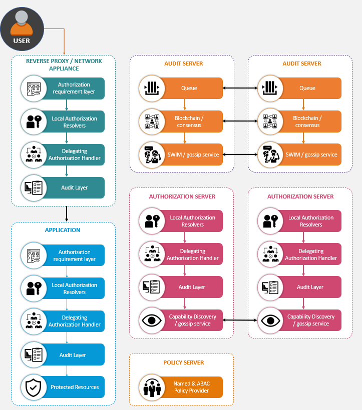

# BeyondAuth

[](https://sonarcloud.io/dashboard?id=ops-ai_authorization)
[](https://opsai.visualstudio.com/Authorization/_build/latest?definitionId=2&branchName=master)
[](https://sonarcloud.io/dashboard?id=ops-ai_authorization)
[](https://sonarcloud.io/dashboard?id=ops-ai_authorization)

A new standard model for authorization and blockchain-based authorization auditing

A distributed, extensible authorization model, based on standard protocols, with centralized authorization policies and the ability to define authorization capabilities that can be validated locally or delegated out; with the option to request more identity context using Vectors of Trust; where authorization decisions are published to a blockchain-based audit log which can be analyzed by the owner of the data it's protecting.

<p align="center">
  
</p>


# Branch structure

Active development happens on the `master` branch. This always contains the latest version and is released nightly to the CI environment. Release branches follow the format `release/0.1.0`. Features and fixes branches follow the format `feature/feature-name` and are submitted as Pull requests to `master`

Branch structure follows Microsoft's [Release Flow](https://docs.microsoft.com/en-us/azure/devops/learn/devops-at-microsoft/release-flow)


More information on application lifecycle can be found at https://scatteredcode.net/application-lifecycle-management-world-class-devops/

# How to build

## Verify GPG Signature
Commits as of 2/1/2020 are signed using GPG. It's recommended to verify all commits after this date come from a trusted source.

## On windows to build the front-end
Requirement due to dependency on [node-gyp](https://github.com/nodejs/node-gyp)

### Option 1
install Visual C++ Build Tools including Vicual C++ build tools
run `npm config set msvs_version 2019`

### Option 2
```
npm install --global windows-build-tools

```

## On Unix to build the front-end install the following
Python v2.7, v3.5, v3.6, or v3.7
make
A proper C/C++ compiler toolchain, like GCC


# Documentation


# Bug reports and feature requests


# Acknowledgements

* [ASP.NET Core](https://github.com/aspnet)
* [IdentityServer4](https://github.com/IdentityServer/IdentityServer4/)
* [gRPC](https://grpc.io/)
* [Json.Net](http://www.newtonsoft.com/json)
* [XUnit](https://xunit.github.io/)
* [Fluent Assertions](http://www.fluentassertions.com/)
* [NSwag](https://github.com/RicoSuter/NSwag)
* [ReDoc](https://github.com/Redocly/redoc)
